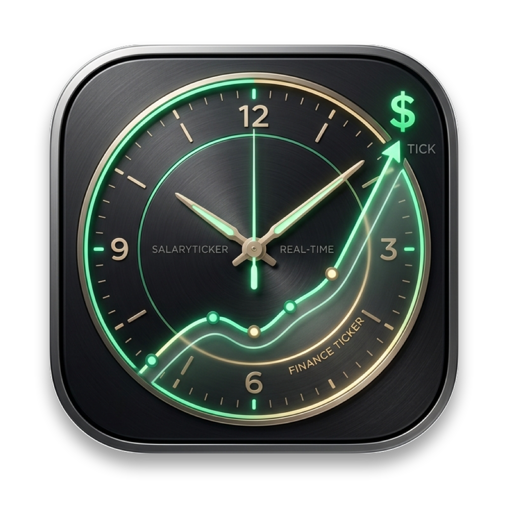

<div align="center">



# ⏱️ SalaryTicker · 时薪

### 优雅的 macOS 状态栏实时每秒薪资流速与打工人看板

*让每一秒的付出都有迹可循，让每一次时钟的跳动都充满收获。*

<br/>

[](https://www.apple.com/macos/)
[](https://swift.org)
[](https://developer.apple.com/xcode/swiftui/)
[](https://developer.apple.com/storekit/)
[-brightgreen?style=flat-square)](https://github.com/chenxia31/Salary)
[](LICENSE)

<br/>

[📥 **下载体验 DMG 安装包 (v1.0.0)**](https://github.com/chenxia31/Salary/raw/main/dist/SalaryTicker.dmg) • [✨ 核心功能](#-核心功能) • [🚀 快速开始](#-快速开始) • [🛠️ 源码构建](#%EF%B8%8F-从源码构建) • [📐 架构设计](#-架构设计与工程规范)

<br/>

```
  ┌────────────────────────────────────────────────────────┐
  │    文件  编辑  显示 ...       🟢 +¥0.051/s  ¥142.86    │ ← 系统状态栏实时跳动
  └────────────────────────────────────────────────────────┘
```

</div>

---

## 🌟 为什么选择 SalaryTicker？

对于每一位在职场打拼的打工人、远程开发者或自由职业者，时间就是最宝贵的资产。然而，传统的月薪制往往让我们的努力变得模糊而漫长。

**SalaryTicker** 将抽象的月薪换算为**每时、每分、每秒**在状态栏跃动的动态数据，并以纯正的 **Apple HIG 磨砂亚克力玻璃质感** 呈现精致看板。打开 Mac，无论是在写代码、做设计、还是开会摸鱼，只要轻瞥一眼屏幕右上角，就能亲眼见证每一秒的入账脉搏！

---

## ✨ 核心功能

### 1. ⚡ 毫秒级流速，平滑不微颤的状态栏常驻
- **等宽数字渲染**：全面应用 `.monospacedDigit()`，数字高频变动时绝无水平晃动与微颤。
- **4 种显示形态随时切换**：
  - `今日已赚`：`+¥158.42`，直观掌控今日累计回报。
  - `每秒流速`：`+¥0.051/s`，感受收入滚滚而来的动态脉搏。
  - `紧凑精简`：`¥158`，极简不占状态栏空间。
  - `极简隐私`：只显示彩色图标，点击下拉才看明细，防止办公室窥屏。

### 2. 🎨 自定义图标与 7 大高定全彩主题
- **原生 SF Symbol 图标库**：精心内置 8 款状态栏图标（如飞升曲线 📈、闪耀金币 🪙、极速仪表盘 ⏱️、公文包 💼、活力心跳 💓 等）。
- **突破 macOS 状态栏单色限制**：采用原生 `NSImage` 调色板引擎与 `isTemplate = false` 技术，提供 7 款高饱和度专属配色：
  - 🟢 **翡翠流金 (Emerald)**
  - 🟡 **流金溢彩 (Gold)**
  - 🔵 **天际微蓝 (Sky Blue)**
  - 🟠 **珊瑚暖光 (Coral)**
  - 🟣 **极光曜紫 (Purple)**
  - 🌈 **工作动态变色 (Dynamic)**：上班绿、午休橙、等待蓝、下班灰
  - ⚪ **极简单色 (Monochrome)**：跟随系统深浅色自动反转
- **即刻生效与实时预览**：在偏好设置中点击任何颜色或图标，状态栏 0 延迟即时刷新，顶部更有同款实时预览卡片。

### 3. 🎯 打工人生活目标与点亮里程碑
- 将冷冰冰的数字转化为触手可及的生活小确幸：
  - ☕ *今日第 1 杯冰美式 (¥28)*
  - 🍱 *今日份豪华工作餐 (¥55)*
  - 🏠 *今日份房租/车贷 (¥120)*
  - 🎮 *数码愿望清单 (¥300)*
- **实时进度卡片**：一旦今日已赚金额突破目标门槛，目标卡片自动点亮变色，赋予满满成就感！
- **完全自由定制**：支持任意添加、编辑目标名称、修改目标金额与删除。

### 4. 📊 三联流速卡片与工时雷达
- **流速三联卡片**：一眼看清自己的 **秒薪 (+¥0.051/s)**、**分薪 (¥3.07/min)** 与 **时薪 (¥184.00/h)**。
- **精准下班倒计时**：清晰显示今日下班剩余时间（如 `02:45:18`）与工时完成度进度条。
- **智能考勤排班**：
  - 自定义上下班时间与午休区间。
  - 支持配置「午休是否计薪」。
  - 智能工作状态机：*开工等待中* → *黄金入账中* → *午休充电中 (金额冻结)* → *打卡下班啦 (锁定全额日薪)*。
  - 支持 **24/7 全天候流速计薪模式**（适合自由职业者、独立开发者与睡后收入流感知）。

### 5. 💖 30 天超长试用与三档随喜爱心赞助
- **诚意试用**：首次安装享有长达 30 天无限制完整功能体验。
- **随喜赞助模式**：试用期结束后提供三档暖心爱心赞助选择：
  - 💧 **¥1.99 · 喝杯水**（解渴润喉）
  - 🍗 **¥5.99 · 加鸡腿**（元气满满）
  - ☕ **¥9.99 · 瑞幸咖啡**（灵感飞扬）
- **支付宝专属收款码 & 微信扫码**：直接使用手机扫一扫赞助任意金额，点击一键激活永久 PRO 特权，零强制弹窗。

---

## 📸 界面抢先预览

```
  ┌────────────────────────────────────────────────────────┐
  │   SalaryTicker 看板 · 星期五 15:42                     │
  ├────────────────────────────────────────────────────────┤
  │                                                        │
  │                  今日已入账 (CNY)                      │
  │                   ¥ 482.35                             │
  │                 ● 正在入账中 · 今日进度 68.4%           │
  │                                                        │
  │  ┌──────────────┬──────────────┬────────────────────┐  │
  │  │   秒薪 (s)   │   分薪 (m)   │      时薪 (h)      │  │
  │  │  +¥0.051/s   │  ¥3.07/min   │      ¥184.00/h     │  │
  │  └──────────────┴──────────────┴────────────────────┘  │
  │                                                        │
  │  今日工时进度                                           │
  │  ████████████████████░░░░░░░░░░   距离下班 02:18:22    │
  │                                                        │
  │  打工人目标里程碑                                      │
  │  [✓] ☕ 冰美式咖啡 (¥28)       ── 已达成!               │
  │  [✓] 🍱 豪华打工午餐 (¥50)     ── 已达成!               │
  │  [●] 🏠 今日份房租 (¥120)      ── 正在努力中 (82%)      │
  │                                                        │
  │  ⚙️ 偏好设置          💎 会员中心          退出应用     │
  └────────────────────────────────────────────────────────┘
```

---

## 🚀 快速开始

### 方式一：直接下载 DMG 安装（推荐）

1. 点击下载最新的安装映像：[**SalaryTicker.dmg**](https://github.com/chenxia31/Salary/raw/main/dist/SalaryTicker.dmg)（约 1.6 MB）。
2. 双击打开 `.dmg` 磁盘映像。
3. 将 **SalaryTicker.app** 拖入 **Applications (应用程序)** 文件夹。
4. 打开 Launchpad 或应用程序启动，即可在右上角状态栏看到常驻图标！

> 💡 **首次打开提示安全性？**
> 如提示“无法打开未知名开发者应用”，只需前往系统 **「系统设置」→「隐私与安全性」**，点击底部的 **「仍要打开」** 即可。

---

## 🛠️ 从源码构建

本项目采用 **Swift 6** 与原生 **Swift Package Manager + XcodeGen** 开发，**零外部第三方代码依赖**，构建极速纯净。

### 环境要求
- macOS 14.0 (Sonoma) 或更高版本 (兼容 macOS 15 Sequoia)
- Xcode 16.0+
- Swift 6.0+

### 1. 克隆代码
```bash
git clone https://github.com/chenxia31/Salary.git
cd Salary
```

### 2. 运行单元测试
```bash
swift test
```
全部 12 项关于薪资流速换算、工作状态机、午休剔除、试用期管理的单元测试将在 0.01 秒内全部通过：
```
✔ Suite "SalaryEngine 纯逻辑测试套件" passed after 0.005 seconds.
✔ Test run with 12 tests in 1 suite passed after 0.005 seconds.
```

### 3. 本地运行调试
```bash
# 命令行极速运行
swift run SalaryTicker

# 或者使用 Xcode 打开开发
open SalaryTicker.xcodeproj
# 在 Xcode 中直接按 Cmd + R 运行
```

### 4. 自动化打包 DMG
我们提供了开箱即用的自动化打包脚本：
```bash
./scripts/build_dmg.sh
```
执行完毕后，将在 `dist/SalaryTicker.dmg` 生成体积仅 1.6MB 的压缩镜像。

---

## 📐 架构设计与工程规范

本项目遵循最高标准的 Apple 平台工程实践：

```
时薪 (SalaryTicker)/
├── App/                    # 应用入口与 AppKit/SwiftUI 生命周期
│   └── SalaryTickerApp.swift
├── Core/                   # 基础设施与纯计算逻辑（100% 单元测试）
│   ├── Calculation/        # SalaryEngine.swift 纯数学薪资与时间计算引擎
│   ├── Storage/            # SalarySettings.swift 配置模型与 UserDefaults 响应式持久化
│   │                       # SubscriptionStore.swift StoreKit 2 订阅与 30 天试用管理
│   └── Logging/            # AppLogger.swift 规范化 os.Logger 日志封装
├── Features/               # 业务模块垂直切片（View + Model + Store 聚合）
│   ├── StatusBar/          # 菜单栏常驻视图、平滑跳动算法、NSImage 彩色渲染
│   ├── Dashboard/          # 亚克力下拉主看板、三联流速卡片、打工目标里程碑
│   ├── Settings/           # 偏好设置、图标色盘实时预览、薪资工时排班
│   └── Paywall/            # Apple HIG 会员中心与 StoreKit 2 付费墙
├── Resources/              # App 图标 (AppIcon.icns)、多语言本地化资源
├── Tests/                  # Swift Testing 现代化严格单元测试套件
├── dist/                   # 预构建可直接分发的 SalaryTicker.dmg 镜像
├── scripts/                # 质量保障与自动化流水线
│   ├── preflight.sh        # 开源/提交流水线预检门禁
│   └── build_dmg.sh        # 一键构建 DMG 安装包脚本
├── specs/                  # 严格的功能规格定义文档 (SPEC)
└── docs/                   # 协作与交接状态文档 (HANDOFF.md, DECISIONS.md)
```

### 关键架构决策
1. **Swift 6 严格并发 (`@MainActor`)**：全部 UI 与数据驱动类遵守严格 Actor 隔离，彻底消除数据竞争隐患。
2. **纯函数核心引擎 (`SalaryEngine`)**：输入月薪、工时与当前时间戳，输出无副作用的结果，计算逻辑与 UI 彻底解耦，保障极端边界情况（跨午休、非工作日、24/7 等）计算 100% 准确。
3. **极低资源开销**：不使用重型 Webview 或跨平台桥接；无 Dock 驻留（`LSUIElement = true`），运行时常驻内存低于 25MB，后台 CPU 占用低于 0.1%。
4. **隐私百分百本地化**：零第三方统计 SDK、零远程网络追踪，您的薪资、工时与所有个人财务数据仅安全保存在您本机的 `UserDefaults`。

---

## 🤝 参与贡献

欢迎提交 Issue 或 Pull Request！在提交代码前，请确保通过全套预检流水线：

```bash
./scripts/preflight.sh
```

---

## 📄 开源协议

本项目采用 [MIT 许可证](LICENSE) 开源。欢迎自由使用、定制与分享！
